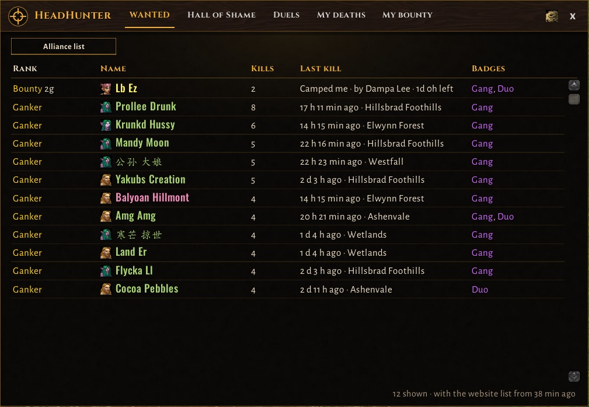
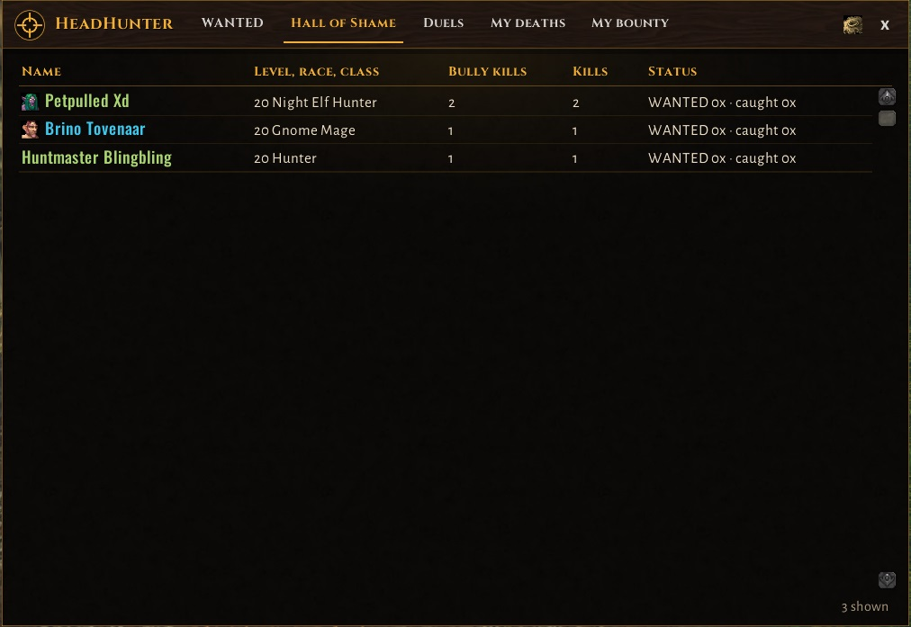
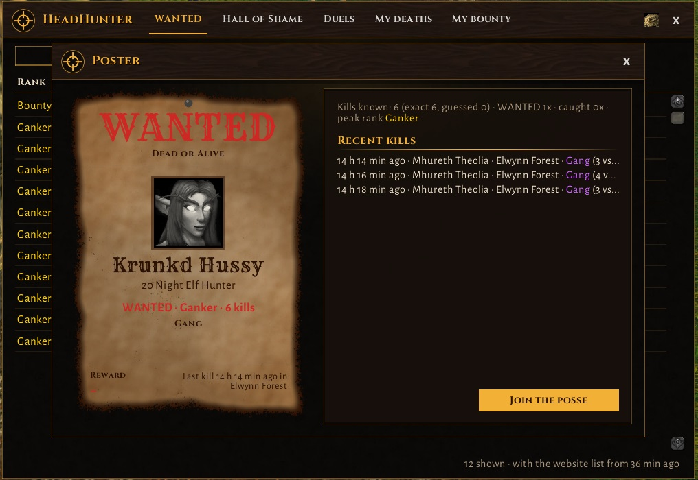
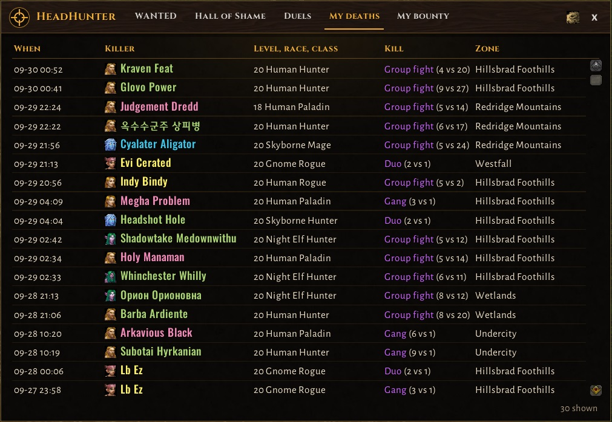
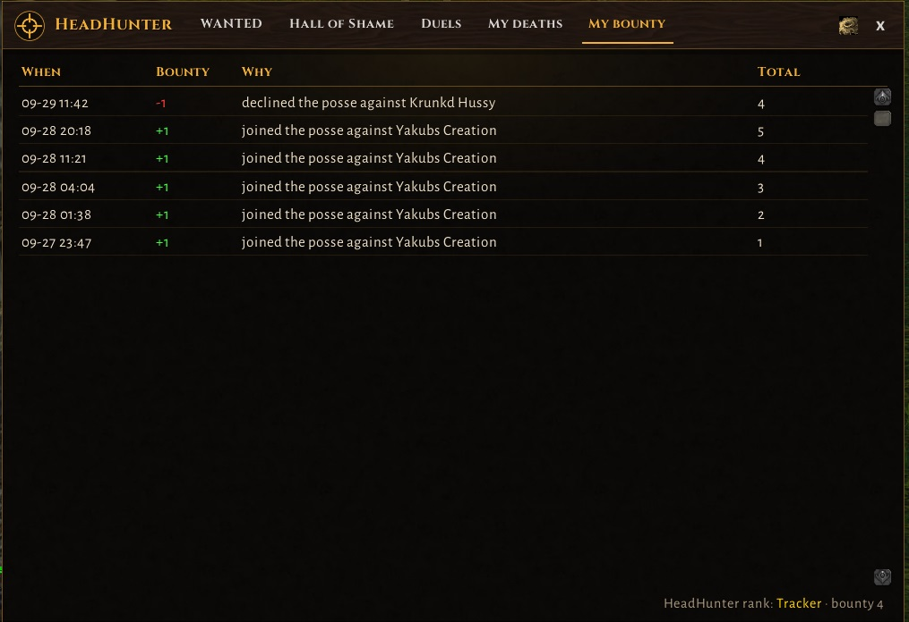
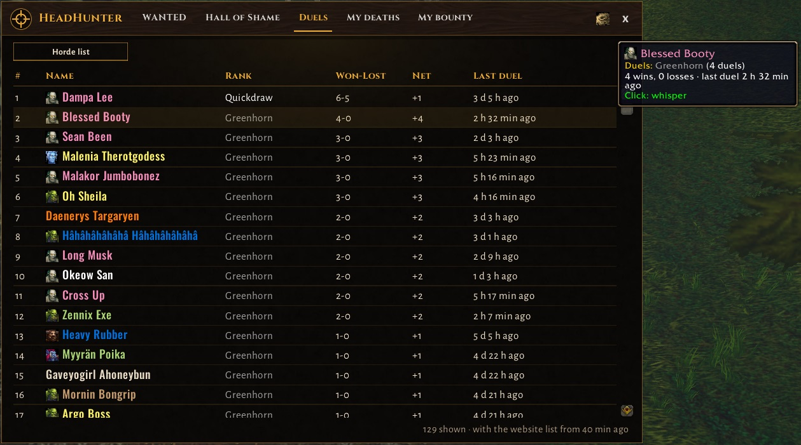

# HeadHunter - Wanted: Dead or Alive

> **简体中文汉化版 · Simplified Chinese localization**
>
> - **原始项目地址 / Upstream**：https://github.com/GudaAddons/HeadHunter （原作者 Vati / GudaAddons，当前 **v0.3.6**）
> - **汉化分支地址 / Localization fork**：https://github.com/erchezhang/HeadHunter-cn
> - **汉化：车长不二 完成**（Simplified Chinese localization by 车长不二）
> - **翻译范围**：主窗口、通缉令、鼠标提示、设置页、地图标记等浏览界面，`/hh help` 的全部命令说明与输出，以及中屏/聊天提醒——全部文案覆盖，并随上游持续同步
> - **实现方式**：从 v0.3.2 起上游已内置官方多语言架构，简体中文位于 **`Locales_zhCN.lua`**（由本仓库车长不二贡献并合入上游，上游 `X-Translated-By: 车长不二 (zhCN, zhTW)`），仅在 `ns.locale == "zhCN"` 时生效，英文客户端读到的仍是原版英文；上游自带 `tests/test_locales.lua` 校验每个键的格式符与颜色码一致
> - **安装 / 译名 / 升级说明**：见 [README.zh-CN.md](README.zh-CN.md)；同步机制与端到端数据流分析见 [docs/工作流程与信息同步报告.md](docs/工作流程与信息同步报告.md)
>
> 原插件无 LICENSE 文件，代码与英文文案版权归原作者；汉化版仅供个人使用与学习，如原作者有异议请开 Issue，会立即处理。
>
> English: this fork tracks GudaAddons/HeadHunter (v0.3.6) with a Simplified Chinese localization (by 车长不二) contributed upstream as `Locales_zhCN.lua`. Upstream: https://github.com/GudaAddons/HeadHunter · Everything below is the original documentation with a Chinese translation under each paragraph.

---

**Got ganked? HeadHunter records who killed you, shares it with your faction and marks WANTED outlaws on the map. Form a posse and bring them to justice.**

**被人偷袭了？HeadHunter 会记录是谁杀了你，把报告共享给你阵营的玩家，并在地图上标记 WANTED 通缉犯。组建追捕队，把他们绳之以法。**

For **Classic Era** and **WoW: Forever**.

适用于 **Classic Era（经典怀旧服）** 与 **WoW: Forever**。

See the WANTED board, the best duelists and the top hunters on **[headhunterwow.com](https://headhunterwow.com)**.

在 **[headhunterwow.com](https://headhunterwow.com)** 查看通缉榜、最强决斗者与顶级猎人。

## How it works · 工作原理

1. **An enemy player kills you.** HeadHunter saves who did it: name, level, class, race and zone. If more than one player attacked you, it saves all of them.
   - **敌方玩家击杀了你。** HeadHunter 记录下凶手：名字、等级、职业、种族与所在区域；如果有多名玩家攻击你，会全部记录。
2. **Your report is shared** with every HeadHunter player of your faction.
   - **你的报告会自动共享**给你阵营的每一位 HeadHunter 玩家。
3. **Gankers become WANTED.** An enemy who kills 4 players within 20 minutes gets a WANTED poster. Every HeadHunter sees the same list.
   - **偷袭者会被通缉。** 敌人在 20 分钟内击杀 4 名玩家就会获得通缉令，所有 HeadHunter 看到的是同一份名单。
4. **Hunt them down.** You get an alert when a WANTED outlaw kills someone near you. Join the posse and go after them.
   - **追杀他们。** 当通缉犯在你附近击杀玩家时你会收到提醒，加入追捕队一同出击。
5. **Justice served.** When a HeadHunter, or anyone in their group, kills a WANTED outlaw, the outlaw is no longer WANTED for everyone.
   - **正法。** 当 HeadHunter 或其队伍成员击倒通缉犯后，该犯对所有人来说都不再是通缉状态。
6. **See it all on the website.** With the free **HeadHunter Sync** app, your reports go to [headhunterwow.com](https://headhunterwow.com), and the website's lists come back into your game.
   - **在网站上看到这一切。** 借助免费的 **HeadHunter Sync** 应用，你的报告会上传到 [headhunterwow.com](https://headhunterwow.com)，网站上的名单也会回传进游戏。

## Features · 功能特性

### WANTED list and ranks · 通缉名单与等级

- An outlaw stays WANTED until a HeadHunter kills them, or until 7 days pass without a new kill.
- 通缉犯会一直被通缉，直到被 HeadHunter 击倒，或连续 7 天没有新击杀为止。
- Ranks grow with kills: **Ganker**, **Outlaw**, **Desperado**, **Most Wanted** and **Dead or Alive**.
- 等级随击杀数增长：**Ganker（偷袭者）** → **Outlaw（亡命徒）** → **Desperado（悍匪）** → **Most Wanted（头号通缉）** → **Dead or Alive（生死不论）**。

### Badges · 徽章

Badges show *how* someone kills, not only how much:

徽章体现的是一个人*怎样*杀人，而不仅仅是杀了多少：

- **Bully**: killed a player 10 or more levels lower, or a grey level player.
  - **欺凌者（Bully）**：击杀了比自己低 10 级以上、或灰色等级的玩家。
- **Duo**: killed a lone player together with one other enemy (2 vs 1).
  - **二打一（Duo）**：与另一名敌人合力击杀单人玩家（2 打 1）。
- **Gang**: killed a lone player in a group of 3 or more.
  - **群殴（Gang）**：以 3 人及以上的队伍击杀单人玩家。
- **Serial Killer**: 5 different victims in separate fights within a short time.
  - **连环杀手（Serial Killer）**：短时间内在互相独立的战斗中击杀 5 名不同受害者。
- **Gunslinger**: most kills were fair, one on one, at a similar level.
  - **快枪手（Gunslinger）**：大多数击杀是同等级的公平一对一。
- **Underdog**: killed higher level players alone.
  - **以弱胜强（Underdog）**：单人击杀了更高等级的玩家。

If your own group was in the fight, the kill shows as a **group fight** (for example 4 vs 3) and gives no Duo or Gang badge. It still counts toward WANTED.

如果你自己的队伍也参与了战斗，该击杀会显示为**团战**（例如 4 打 3），不会获得"二打一"或"群殴"徽章，但仍计入通缉统计。

### Hall of Shame · 耻辱柱

- **Bullies**: every enemy with the Bully badge, WANTED or not. They stay as long as HeadHunter knows one of their lowbie kills (30 days). With the HeadHunter Sync app you also get the website's bullies of both factions, so your list matches the website.
  - **欺凌者**：每一个带"欺凌者"徽章的敌人，无论是否被通缉。只要 HeadHunter 还知道他的一次低级击杀（30 天），就会留在名单上。配合 HeadHunter Sync 应用，还能看到官网记录的双方阵营欺凌者，与官网名单保持一致。
- **Deadbeats**: players who did not pay a gold bounty they posted (see *Gold bounties*). They are listed for 30 days, and they cannot post bounties during that time.
  - **老赖（Deadbeat）**：发布了金币悬赏却不支付的玩家（见*金币悬赏*）。名单保留 30 天，期间他们无法发布悬赏。
- You get an alert when a bully or a Deadbeat is near. Turn it off in the options (**Hall of Shame alerts**).
  - 欺凌者或老赖靠近时你会收到提醒，可在选项中关闭（**耻辱柱提醒**）。
- Bring down a bully, or a Deadbeat of the other faction, and you get **+3 bounty**, once per player per hour. They stay on the list.
  - 击倒一名欺凌者或对方阵营的老赖，可获得 **+3 赏金**（每人每小时一次），他们仍会留在名单上。

### Alerts · 提醒

- **WANTED sighting**: "WANTED Ganker X is here!" when a WANTED outlaw shows up on your screen, even in combat.
  - **通缉目击**：通缉犯出现在你屏幕上时提示"通缉 偷袭者 X 出现了！"，战斗中也会提示。
- **WANTED activity**: a WANTED outlaw killed someone near you. Click **Join the posse** or **Decline**. HeadHunter shows at most one popup every 3 minutes. After a Decline, or a popup you let close by itself, you get no more of these popups for 20 minutes, only chat lines. While you ride with a posse, other outlaws only ask when they are in your zone. Only players close to the outlaw's level get this popup, the others get a chat line. If the victim is on another layer and died again within 15 minutes, joining also asks them for a group invite.
  - **通缉活动**：通缉犯在你附近击杀了玩家。点击**加入追捕队**或**拒绝**。HeadHunter 每 3 分钟至多弹一次窗；拒绝或让弹窗自行关闭后，20 分钟内不再弹窗，只在聊天提示。你已在追捕队中时，其他通缉犯只有出现在你所在区域才会询问。只有等级接近通缉犯的玩家会收到弹窗，其他人只收聊天行。若受害者在另一分层且 15 分钟内再次阵亡，加入时还会向其请求组队邀请。
- **Justice served**: a message when a WANTED outlaw is brought down.
  - **正法**：通缉犯被击倒时的消息。
- **Gold bounty sighting**: "BOUNTY: X is here!" when a player with a gold bounty on them shows up.
  - **赏金目击**：身上有金币悬赏的玩家出现时提示"赏金：X 出现了！"。
- **Your bounty is claimed**: a message when a HeadHunter brings down the player you put gold on.
  - **你的悬赏被领取**：HeadHunter 击倒了你挂了金的玩家时的消息。
- **Hall of Shame**: "BULLY: X is here!" or "DEADBEAT: X is here!", at most once every 10 minutes per player.
  - **耻辱柱**："欺凌者：X 出现了！"或"老赖：X 出现了！"，每人每 10 分钟至多一次。
- **You are WANTED**: with the HeadHunter Sync app, HeadHunter tells you at login when the other faction has you on its WANTED list.
  - **你被通缉了**：配合 HeadHunter Sync 应用，登录时若对方阵营的通缉名单上有你，HeadHunter 会提醒你。
- **PvP hotspots**: Skirmish, Battle or Warzone when a big fight happens near you. The popup names the enemies in the fight and the HeadHunters of your side fighting there. Click **Help** to get the way to the fight: the HeadHunters fighting there see that you are coming, and if they are on another layer, one of them is asked for a group invite.
  - **PvP 热点**：你附近爆发大规模战斗时，提示遭遇战、战斗或战区。弹窗会列出交战的敌人与你方参战的 HeadHunter。点击**支援**即可获得前往战场的指引：正在交战的 HeadHunter 会知道你在赶来，若他们在另一分层，其中一人会收到组队邀请。

### World map · 世界地图

- A red **PVP** area shows where fights are happening. It gets darker as the fight grows and stays for 20 minutes after the last fight.
  - 红色 **PVP** 区域表示正在发生战斗的位置；战斗规模越大颜色越深，最后一次战斗后保留 20 分钟。
- A **skull** shows where a WANTED outlaw made their last kill (for 10 minutes). The map shows the 10 biggest fights and the 10 highest ranked outlaws.
  - **骷髅**标记通缉犯最近一次击杀的位置（保留 10 分钟）。地图最多显示 10 处最大规模的战斗和 10 名等级最高的通缉犯。

### HeadHunter window · HeadHunter 窗口

Type `/hh` or click the minimap button:

输入 `/hh` 或点击小地图按钮打开：

- **WANTED**: everyone who is WANTED now, sorted by rank, kills or last kill, with a switch between the Alliance and Horde lists (the enemy list opens first). Gold bounties are listed on top. While few outlaws are WANTED, the list fills up to 25 with outlaws **at large**: their WANTED time ran out, but nobody caught them. You get the same alert when you meet one, and catching one still pays their bounty.
  - **通缉**：当前所有被通缉的人，可按等级、击杀数或最近击杀排序，左上角可切换联盟/部落名单（默认先开敌方名单）。金币悬赏排在最前；通缉犯较少时，名单会用最多 25 名**在逃**犯补满——他们的通缉时间已过但从未落网。遇到在逃犯同样会收到提醒，抓到他们照样有赏金。
- **Hall of Shame**: every known bully, and the Deadbeats.
  - **耻辱柱**：所有已知的欺凌者与老赖。
- **Duels**: the best duelists, with a switch between the Alliance and Horde lists.
  - **决斗**：最强的决斗者，可切换联盟/部落名单。
- **My deaths**: who killed you, when and where.
  - **我的死亡**：谁在何时何地击杀了你。
- **My bounty**: the bounty you collected and your hunter rank.
  - **我的赏金**：你积累的赏金与猎人等级。

On **Hall of Shame**, **Duels** and **My deaths**, a search box finds a player by name. Each tab keeps its own search.

在**耻辱柱**、**决斗**与**我的死亡**页签中，可用搜索框按名字查找玩家，每个页签单独保留自己的搜索词。

The window has the same look as the website. Too big or too small for your screen? Change **Window size** in the options (90% to 130%).

窗口外观与官网一致。在屏幕上显得太大或太小？可在选项中调整**窗口大小**（90% 至 130%）。

Hover a name for details, or click it to open their **WANTED poster** in the middle of the window: an old paper poster with a black and white picture of their race, their name, rank, kills, badges and the gold on their head. Next to it: their history, recent kills, the posse, gold bounties and the **Join the posse** and **Post a bounty** buttons.

鼠标悬停名字查看详情，点击可在窗口中央打开其**通缉令**：一张复古纸质海报，印有种族黑白画像、名字、等级、击杀数、徽章与头顶悬赏金额；旁边列出其历史记录、近期击杀、追捕队、金币悬赏，以及**加入追捕队**和**发布悬赏**按钮。

### Enemy tooltips · 敌人鼠标提示

Mouse over an enemy player to see if they are WANTED, their rank, kills and badges. Any player with duels also shows their duel rank.

把鼠标移到敌方玩家身上，可看到其是否被通缉、等级、击杀数与徽章；有决斗记录的玩家还会显示决斗段位。

### Posse and hunter ranks · 追捕队与猎人等级

- Join a posse to hunt an outlaw together. Posse members see each other.
  - 加入追捕队，与他人一起猎杀通缉犯；追捕队员之间可以互相看到。
- Collect **bounty**: +1 for joining a posse (once per outlaw while they are WANTED), and +3 to +20 when you or your group bring down a WANTED outlaw (the higher their rank, the bigger the bounty). +5 for bringing down a player with a gold bounty, +3 for a bully or the other faction's Deadbeat. Declining costs 1; a popup that closes by itself costs nothing.
  - 攒取**赏金**：加入追捕队 +1（每个通缉犯在其通缉期间一次），你或你的队伍击倒通缉犯 +3 至 +20（对方等级越高赏金越多）；击倒有金币悬赏的玩家 +5，击倒欺凌者或对方阵营老赖 +3；拒绝扣 1，弹窗自行关闭不扣。
- No bounty for hunting players 10 or more levels below you. Hunting down is ganking too.
  - 猎杀比自己低 10 级以上的玩家没有赏金——追杀低级同样算偷袭。
- Hunter ranks: **Tracker**, **Bounty Hunter**, **Manhunter**, **Headhunter** and **Reaper**.
  - 猎人等级：**追踪者（Tracker）** → **赏金猎人（Bounty Hunter）** → **追猎者（Manhunter）** → **猎头者（Headhunter）** → **死神（Reaper）**。

### Gold bounties · 金币悬赏

Got ganked? Put gold on your killer's head.

被人偷袭了？在凶手头上挂赏金。

- From level 15: open the poster of an enemy (level 15 or higher too) who killed you, or helped, in the last 24 hours and click **Post a bounty**. Pick a reason (Camped me, Ganked me while I fought mobs, Killed me at low level, Killed me in a group), the gold (2g to 15g) and how long it runs (1, 2, 3 or 7 days). One bounty at a time.
  - 15 级起：打开最近 24 小时内击杀你（或参与击杀）的敌人的通缉令（对方也需 15 级及以上），点击**发布悬赏**。选择原因（蹲守杀我 / 我打怪时偷袭我 / 我低等级时杀我 / 组队杀我）、金额（2–15 金）与持续时间（1、2、3 或 7 天）。同一时间只能有一个悬赏。
- Every HeadHunter of your faction sees it: on top of the WANTED list, on the tooltip and the poster, and with an alert when they meet the target.
  - 你阵营的每位 HeadHunter 都能看到：通缉名单顶部、鼠标提示与通缉令上，遇到目标时还会收到提醒。
- The HeadHunter who lands the killing blow wins the gold, and everyone who saw it gets +5 bounty. No gold for hunting 10 or more levels down. One kill wins one bounty (the biggest); the others stay open. The same hunter cannot claim on the same player again for 7 days.
  - 造成致命一击的 HeadHunter 获得金币，所有看到这一幕的人 +5 赏金。猎杀低 10 级以上的玩家没有金币；一次击杀只领取一份悬赏（金额最大的那份），其余仍保持有效；同一名猎人 7 天内不能对同一玩家再次领取。
- You get a message when your bounty is claimed. At your next mailbox, HeadHunter asks you to send the gold, and one click writes the mail. HeadHunter never sends gold without your click, and never more than you posted.
  - 悬赏被领取时你会收到消息。到达下一个邮箱时，HeadHunter 会提示你寄出金币，点击一次即可写好邮件；未经你点击，HeadHunter 绝不寄钱，也绝不会超过你发布的金额。
- The hunter's HeadHunter sees your mail and marks you as **pays up**. Not paid after 3 days, the claim is unpaid. If you do not pay, you are a **Deadbeat**: no bounties for 30 days and your name in the Hall of Shame. Paying late gets you out.
  - 猎人一方的 HeadHunter 会看到你的邮件并把你标记为**已付清**。3 天内不付即视为赖账；不付就是**老赖**：30 天内不能发布悬赏，名字进耻辱柱；补交会解除。
- If the same hunter claimed on that player before, the mail window warns you that it may be an alt. You can refuse that one without becoming a **Deadbeat**.
  - 如果同一名猎人此前就对该玩家领取过悬赏，邮件窗口会警告你对方可能是小号；这种情况你可以拒绝支付而不会变成**老赖**。
- **Classic Era:** after claiming, click **Announce** (or type `/hh claim`) so the owner hears about it, even outside your guild and group.
  - **Classic Era**：领取后请点击**宣告**（或输入 `/hh claim`），让悬赏发布者即使不在你的公会/队伍里也能收到消息。

### Catch-up · 登录补齐

When you log in, HeadHunter asks other HeadHunters what you missed while you were offline, so your WANTED list is up to date.

登录时，HeadHunter 会向其他 HeadHunter 询问你离线期间错过的消息，让通缉名单保持最新。

### Who is online · 在线人数

Type `/hh online` to see how many HeadHunters are online right now, how many are Alliance and how many are Horde.

输入 `/hh online` 查看当前在线的 HeadHunter 数量，以及联盟、部落各多少。

- **WoW Forever:** everyone in your region, both factions.
  - **WoW Forever**：你所在区域的所有人，包含双方阵营。
- **Classic Era:** only your guild and group. The game does not let addons count further.
  - **Classic Era**：只有你的公会与队伍，游戏不允许插件统计更多。
- With more than 500 online, it says **500+**.
  - 在线超过 500 时显示 **500+**。

### Duels · 决斗

- Classic Era: every duel next to a HeadHunter counts, even when the duelists do not use the addon, as long as HeadHunter knows both levels (target or mouse over the duelists). WoW Forever: duels count when one of the duelists uses HeadHunter. Running away counts as a loss.
  - Classic Era：发生在 HeadHunter 玩家身边的每场决斗都计入，即使对方没装插件（前提是能读到双方等级：选中或指向决斗者）；WoW Forever：决斗一方使用 HeadHunter 即计入。逃跑判负。
- Only duels between players of level 10 or higher, at most 5 levels apart, count. Beating lowbies does not help.
  - 只有 10 级及以上、等级差不超过 5 级的玩家之间的决斗计入；打赢低级玩家没有帮助。
- Duels are shared like death reports, and never make anyone WANTED.
  - 决斗记录与死亡报告一样会被共享，且永远不会让人被通缉。
- Click a player of your own faction in the Duels list to whisper them.
  - 点击决斗名单中同阵营的玩家可向其密语。
- Ranked by record: wins minus losses first, then fewer losses. 6-1 is ahead of 8-3. With the same record, whoever got there first is ahead. You are listed from your first duel.
  - 按战绩排名：先看净胜场，再看负场更少者；6 胜 1 负排在 8 胜 3 负之前；战绩相同则先达成者靠前，从你的第一场决斗起就会入榜。
- Ranks by net wins: **Quickdraw**, **Sharpshooter** (+5), **Deadeye** (+15) and **Legend** (+30). Under 5 duels you are a **Greenhorn**, listed after everyone with 5 or more.
  - 按净胜场定段位：**快拔（Quickdraw）**、**神射手（Sharpshooter，+5）**、**鹰眼（Deadeye，+15）**、**传奇（Legend，+30）**；不足 5 场决斗为**新手（Greenhorn）**，排在所有 5 场及以上玩家之后。
- The #1 of each faction is the **Top Gun**, once they are 5 or more wins ahead (Sharpshooter) and nobody else at the top has the same record. A Greenhorn cannot be Top Gun.
  - 每个阵营的第一名是**王牌（Top Gun）**，条件是领先第二名至少 5 个净胜场（达到神射手标准）且榜首没有相同战绩者；新手不能成为王牌。

## Website and the HeadHunter Sync app · 网站与 HeadHunter Sync 应用

**[headhunterwow.com](https://headhunterwow.com)** is the bounty board of every HeadHunter player: WANTED posters, the best duelists, the top hunters and the Hall of Shame, for each game and realm. Sign in with Battle.net, Discord, Google or email to see your own characters.

**[headhunterwow.com](https://headhunterwow.com)** 是所有 HeadHunter 玩家的悬赏公告板：按游戏与服务器列出通缉令、最强决斗者、顶级猎人与耻辱柱。用 Battle.net、Discord、Google 或邮箱登录即可看到自己的角色。

A WoW addon cannot use the internet. That is why there is a small, free desktop app: **HeadHunter Sync**. It connects the game and the website.

WoW 插件无法访问互联网，因此有一个免费的桌面小程序：**HeadHunter Sync**，它负责连接游戏与网站。

1. **Download** HeadHunter Sync for Windows or Mac from [GitHub](https://github.com/GudaAddons/headhunter-sync/releases/latest) and sign in with your website account.
   - **下载** Windows 或 Mac 版 HeadHunter Sync（[GitHub](https://github.com/GudaAddons/headhunter-sync/releases/latest)），用你的网站账号登录。
2. **Play as usual.** When the game saves (logout, `/reload` or quit), the app sends your deaths, catches, duels, bounty and gold bounties to the website. It runs quietly in the tray.
   - **照常游戏。** 游戏存档时（登出、`/reload` 或退出），应用会把你的死亡、击倒、决斗、赏金与金币悬赏发送到网站，平时安静地待在托盘里。
3. **Get the website's lists back.** The app also writes the website's WANTED list, duel lists and your own records into the game, as a small extra addon called **HeadHunter Data**. You see them after your next login or `/reload`.
   - **把网站的名单取回来。** 应用还会把网站的通缉名单、决斗榜与你的个人记录写进一个名为 **HeadHunter Data** 的小插件，下次登录或 `/reload` 后即可看到。
4. **WoW Forever:** when your lists reset (see *Good to know*), the app brings your own deaths, duels and bounty back.
   - **WoW Forever**：当你的名单被重置时（见*注意事项*），应用会把你的死亡、决斗与赏金记录带回来。
5. **Every realm keeps its own data:** PvP, Normal, Roleplay and Hardcore (and every Classic Era realm) each have their own lists, deaths, duels and bounty. A character on a Normal realm sees only Normal realm data. HeadHunter data saved before this update went to the WoW Forever PvP realm.
   - **每个服务器数据独立：**PvP、普通、角色扮演与硬核（以及每个 Classic Era 服务器）各有自己的名单、死亡、决斗与赏金；普通服角色只看到普通服数据；此次更新前保存的数据归入 WoW Forever 的 PvP 服务器。

Good to know about the app:

关于该应用的注意事项：

- The app only reads HeadHunter's saved data and only talks to headhunterwow.com. Nothing else on your PC is touched.
  - 应用只读取 HeadHunter 的存档，且只与 headhunterwow.com 通信，不碰你电脑上的其他东西。
- It updates itself.
  - 应用会自动更新。
- The first time, Windows may say "Windows protected your PC". Click **More info**, then **Run anyway**. On a Mac, right-click the app and choose **Open**.
  - 首次运行时 Windows 可能提示"Windows 已保护你的电脑"，点击**更多信息**再选**仍要运行**；Mac 上右键应用选择**打开**。
- The addon works fine without the app. The app only adds the website.
  - 不装该应用插件也完全可用，应用只是额外带来网站功能。

## Commands · 命令

| Command | What it does |
|---|---|
| `/hh` | Open the HeadHunter window 打开 HeadHunter 窗口 |
| `/hh help` | List all commands 列出全部命令 |
| `/hh options` | Open the options page 打开选项页 |
| `/hh wanted` | WANTED list in chat 在聊天中输出通缉名单 |
| `/hh outlaw <name>` | Details about one enemy 查看某个敌人的详情 |
| `/hh deaths` | Your recent PvP deaths 你最近的 PvP 死亡 |
| `/hh posse` | Who is hunting which outlaw 谁在追捕哪个通缉犯 |
| `/hh bounty` | Your hunter rank and the bounty you collected 你的猎人等级与积累的赏金 |
| `/hh hotspots` | PvP activity per zone 各区域的 PvP 活动 |
| `/hh duels` | Duels: the best duelists and your rank 决斗：最强决斗者与你的排名 |
| `/hh map on/off` | PvP areas and skulls on the world map 世界地图上的 PvP 区域与骷髅标记开关 |
| `/hh tooltip on/off` | WANTED line on enemy tooltips 敌人鼠标提示上的通缉行开关 |
| `/hh minimap` | Show or hide the minimap button 显示或隐藏小地图按钮 |
| `/hh claim` | Announce your gold bounty claim to all HeadHunters (Classic Era) 向所有 HeadHunter 宣告你领取了金币悬赏（Classic Era） |
| `/hh catchup` | Ask other HeadHunters what you missed 向其他 HeadHunter 索取你错过的内容 |
| `/hh online` | How many HeadHunters are online, per faction 在线的 HeadHunter 数量（按阵营） |

All settings are also on the options page: **Esc > Options > AddOns > HeadHunter**.

所有设置也都在选项页：**Esc > 选项 > 插件 > HeadHunter**。

## Good to know · 注意事项

- **Classic Era:** reports go to your guild and group automatically. To reach every HeadHunter on the realm, click **Report** after a death (or type `/hh report`). The same goes for **Announce** after you bring down an outlaw (`/hh justice`). The game only allows these realm-wide messages after a click.
  - **Classic Era**：报告会自动发送给公会与队伍；要通知全服的 HeadHunter，死亡后点击**报告**（或输入 `/hh report`），击倒通缉犯后同理点击**宣告**（`/hh justice`）。游戏只允许点击触发的全服消息。
- **Classic Era** has no map waypoints, so HeadHunter tells you the coordinates in chat instead.
  - **Classic Era** 没有地图路径点功能，HeadHunter 会在聊天中告诉你坐标。
- **WoW: Forever** shares everything automatically.
  - **WoW: Forever** 的所有内容自动共享。
- **WoW: Forever is in testing mode.** The Forever client does not load saved data back (a known client issue, not a HeadHunter bug), so your lists and settings reset on every reload or login. Catch-up handles it: when you log in, other HeadHunters send back what you missed, so your lists refill from the realm. The HeadHunter Sync app also brings your own records back from the website. HeadHunter tells you this in chat when you log in on Forever.
  - **WoW: Forever 处于测试模式**：Forever 客户端不会回读存档（已知客户端问题，非插件 bug），每次重载或登录后名单与设置都会重置。登录补齐机制会处理这一点：登录时其他 HeadHunter 会把你错过的内容发回来，名单随之从服务器重建；HeadHunter Sync 应用也会从网站带回你的个人记录。在 Forever 登录时 HeadHunter 会在聊天中说明此事。
- HeadHunter is off in dungeons, raids and battlegrounds. Duels never count as PvP kills.
  - 副本、团队副本与战场中 HeadHunter 处于关闭状态；决斗永远不算 PvP 击杀。
- Gold bounties are paid by mail between players of the same faction. HeadHunter never holds your gold.
  - 金币悬赏通过同阵营玩家之间的邮件支付，HeadHunter 从不代管你的金币。
- **Classic Era:** the other faction's Deadbeats reach you through the website, so use the HeadHunter Sync app. WoW Forever shares them directly.
  - **Classic Era**：对方阵营的老赖名单通过网站传递，请使用 HeadHunter Sync 应用；WoW Forever 直接共享。
- The more players use HeadHunter, the better it works. Tell your guild!
  - 使用 HeadHunter 的人越多，效果越好。告诉你的公会吧！
